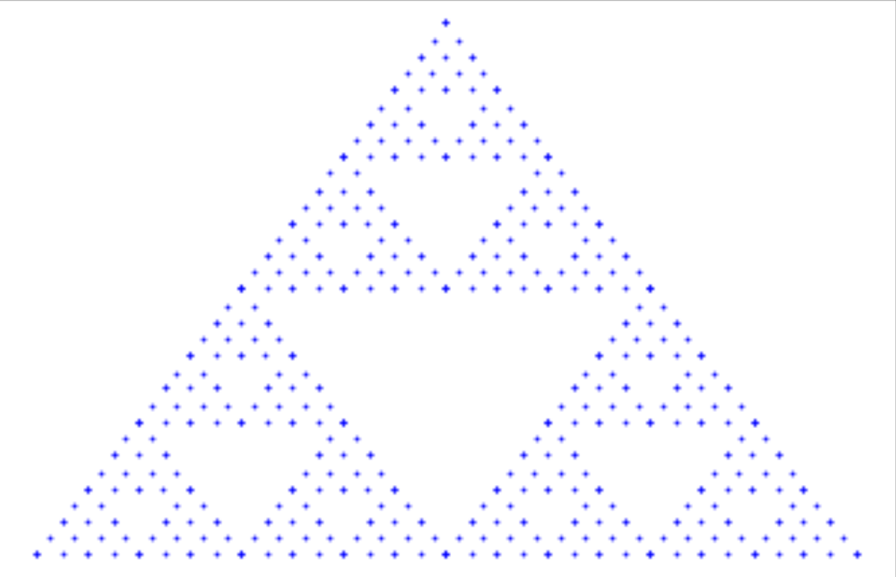

# Sierpinski-Triangle

The Sierpiński triangle, is a fractal attractive fixed set with the overall shape of an equilateral triangle, subdivided recursively into smaller equilateral triangles.

Just run the ***ipynb*** it will do the job for you.

It shall print the output the triangle as a png as

